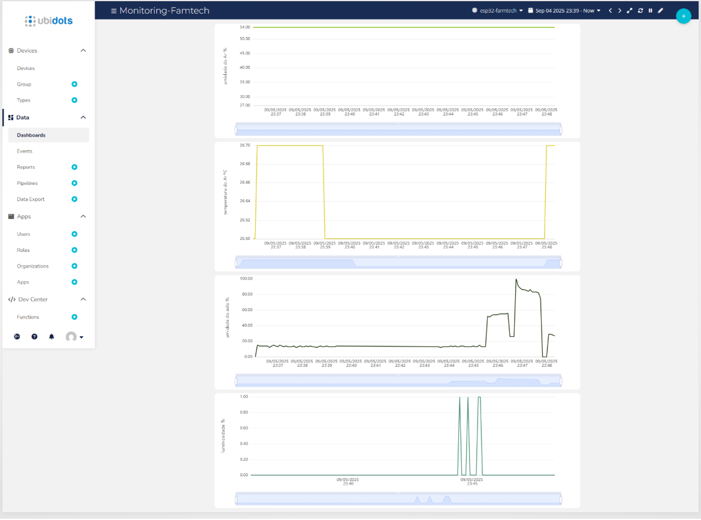

# Faculdade de Informática e Administração Paulista 

<p align="center">
  <a href="https://www.fiap.com.br/">
    
  </a>
</p>

<br>

## Grupo 36

## Integrantes: 
- <a href="https://github.com/FelipeSabinoTMRS">Felipe Sabino da Silva</a>
- <a href="https://github.com/juanvoltolini-rm562890">Juan Felipe Voltolini</a>
- <a href="https://github.com/Luiz-FIAP">Luiz Henrique Ribeiro de Oliveira</a> 
- <a href="https://github.com/marcofiap">Marco Aurélio Eberhardt Assimpção</a>
- <a href="https://github.com/PauloSenise">Paulo Henrique Senise</a> 

## Professores:
### Tutor(a) 
- <a href="https://github.com/Leoruiz197">Leonardo Ruiz Orabona</a>
### Coordenador(a)
- <a href="https://github.com/agodoi">André Godoi</a>

---

# FarmTech – Projeto Ir Além (1º Opção)

Sistema de **monitoramento e automação agrícola** utilizando **ESP32** com sensores de temperatura, umidade, luminosidade e solo, integrado ao **Ubidots** para visualização em tempo real.  

Projeto desenvolvido como parte da disciplina **Ir Além – FIAP 2025**.

---

## Funcionalidades

- **Coleta de dados** com sensores:
  - **DHT11** → Temperatura e Umidade do ar  
  - **LDR** → Luminosidade (claro/escuro)  
  - **Sensor de Solo** → Umidade (%)  
- **Exibição local** dos valores em display OLED  
- **Integração com Ubidots** para monitoramento em dashboard  
- **Controle automático de bomba** via módulo relé  
- **Processamento inteligente** com filtro EMA e histerese para evitar acionamentos falsos  

---

## Arquitetura do Sistema


---

## Fluxograma de Funcionamento


---

## Protótipo em Protoboard


---

## ESP32 Utilizado


---

## Monitoramento no Ubidots

A estação envia os dados em tempo real para a nuvem, onde podem ser visualizados em gráficos no **dashboard do Ubidots**:


---

## Tecnologias Utilizadas

- **ESP32 NodeMCU**  
- **Arduino IDE**  
- **Sensores**: DHT11, LDR, Sensor de Umidade de Solo  
- **Módulo Relé** para acionamento da bomba  
- **Display OLED** para exibição local  
- **Ubidots** (IoT Cloud) para monitoramento remoto  

---

## Exemplo de Dados no OLED

```
Temp: 25.6°C
Umid: 41%
Luz: Claro
Solo: 100%
Bomba: ON
```

---

## Estrutura do Repositório

```
fase5-cap1-ir-alem-primeira-opcao/
│── assets/          # imagens e fluxogramas
│── src/             # código-fonte do ESP32
│── README.md        # documentação do projeto
│── LICENSE
│── .gitignore
```

---


